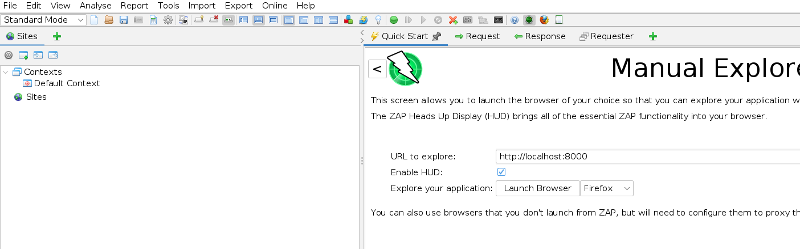
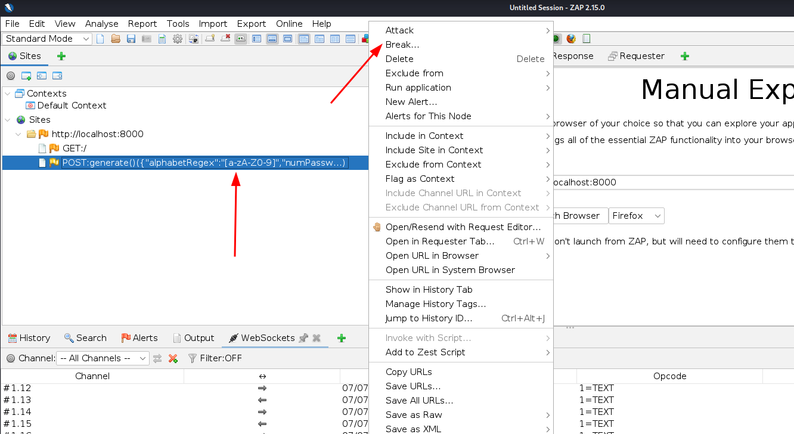
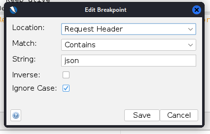
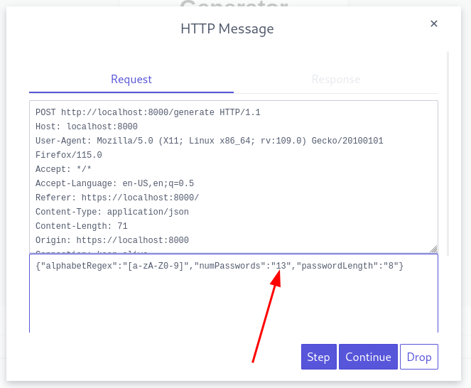

# RegPassGen

Regex Password Generator.

## Prerequisites

- `python >= 3.11`
- `python-venv`

In Kali Linux, you can run `apt install python3.11-venv` as the root user.

## Usage

1. Open the terminal.

2. Navigate to the project directory:

   ```bash
   cd SoftSec/HW1
   ```

3. Run the application:

   ```bash
   bash run.sh
   ```

   This command will start a local web server on port 8000.

## Bypassing client-side limits

The frontend (client-side) incorporates a validation check to ensure that no more than 10 passwords are requested at a time. If the user attempts to request more, an alert is displayed, and the form submission is prevented.

However, to demonstrate the insufficiency of client-side validation, we will bypass this limit using OWASP ZAP.

1. Launch OWASP ZAP and navigate to the "Manual Explore" in the Quick Start menu. Enter the URL of the web application `http://localhost:8000` and click on "Enable HUD".

   

2. Click "Launch Browser" and perform a request by entering a value in the "Number of passwords" field and clicking "Generate".

3. Switch to OWASP ZAP and locate the POST request under "Sites". Right-click on it and select "Break".

   

4. Modify the breakpoint as follows and click "Save".

   

5. Return to the browser and click "Generate" again. OWASP ZAP will now intercept the request.

6. A screen will appear showing the intercepted request. Change the value of `numPasswords` to a number greater than 10.

   

7. Finally, verify in the browser that more than 10 passwords are generated!
