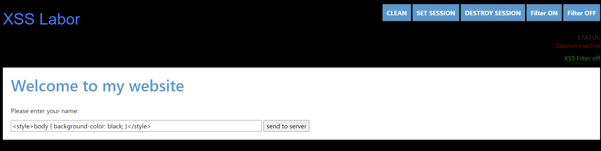
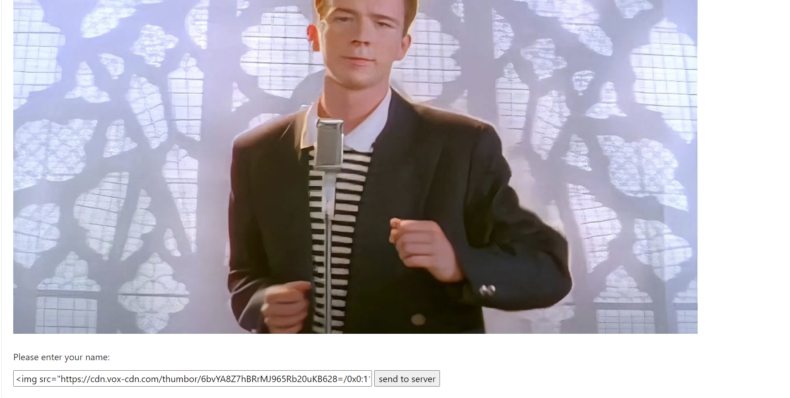
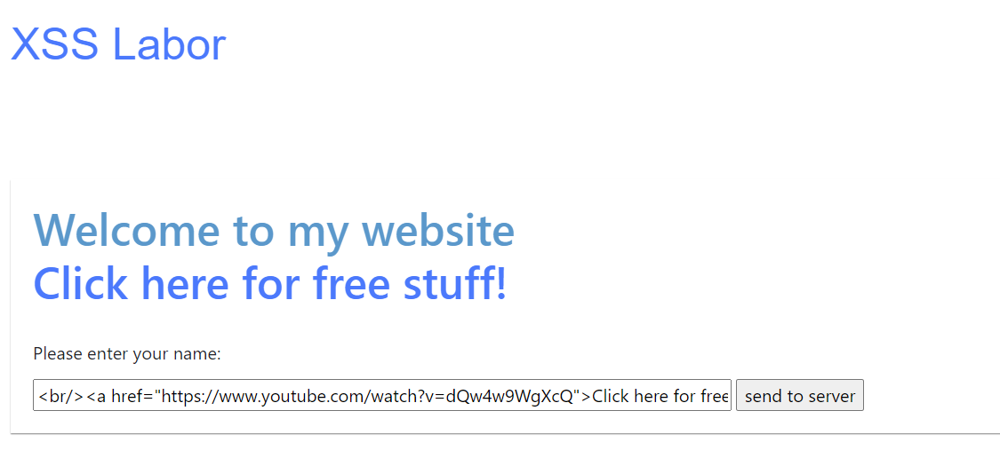
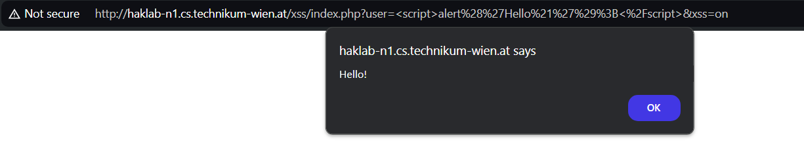
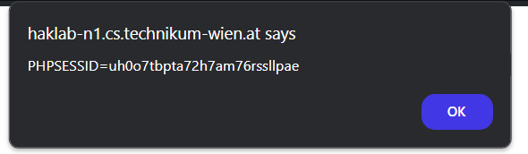
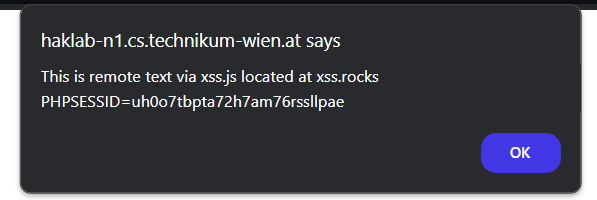

# XSS

Challenge 1: Site Defacing / HTML Injections

1. Set the background to a different color
2. Display another image on the website
3. Create a link on the website

Challenge 2: JavaScript / Cross Site Scripting

1. Popup: Display a message to the client
2. Redirect the client to some other website
3. Create a session with the server and display the current sesssion ID
4. Try to load JS code from a different web source into the website

Challenge 3: Javascript / Cookie Catcher

1. Write a "Cookie Catcher", Clientside: Javascript, Backend: PHP

## Challenge 1

1. name: ``

    

2. name: ``

    

3. name: ` <a href="https://www.youtube.com/watch?v=dQw4w9WgXcQ">Click here for free stuff!</a>`

    

    Here, I used ` ` to add a newline.

## Challenge 2

1. name: ``

    

2. name: ``

3. name: ``
    
    

4. name: ``
    
    

## Challenge 3

Install PHP and then run a PHP development server in the HW3 folder using `php -S localhost:8000`.

Then, in the website, write:

name: ``

You will receive a request similar to this on your PHP server:

`[Sun Jul  7 15:37:14 2024] 127.0.0.1:48536 [200]: GET /cookie.php?cookie=PHPSESSID%3Duh0o7tbpta72h7am76rssllpae`

And the file `cookies.log` will be created with the cookie.
