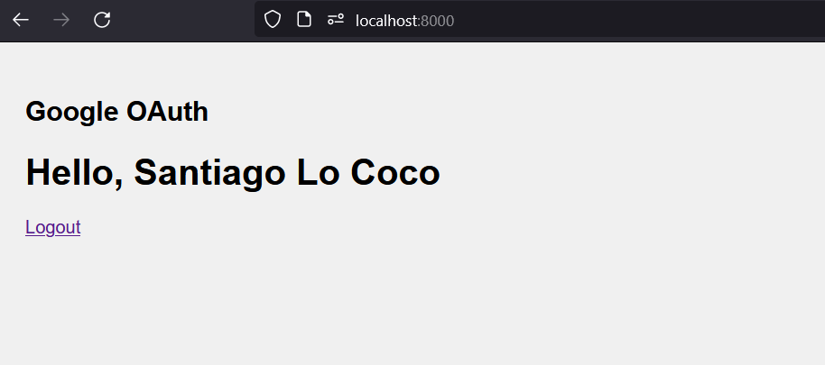

# Authentication

## Project structure

- `basic/`: Contains the implementation for basic form authentication.
- `digest/`: Contains the implementation for HTTP digest authentication.
- `google/`: Contains the implementation for Google OAuth authentication.

## Prerequisites

- `python >= 3.11`
- `python-venv`

In Kali Linux, you can run `apt install python3.11-venv` as the root user.

## Usage

### Basic

1. Open the terminal.

2. Navigate to the project directory:

   ```bash
   cd SoftSec/HW4/basic
   ```

3. Run the application:

   ```bash
   bash run.sh
   ```

### Digest and Google


1. Open the terminal.

2. Navigate to the project directory:

   ```bash
   cd SoftSec/HW4/basic
   ```

3. Configure the `.env`:

   ```bash
   cp .env.dev .env
   ```

3. Run the application:

   ```bash
   bash run.sh
   ```

Note: For Google OAuth authentication, you will need to create a Google client ID and a client secret. Refer to the Google developer console documentation for instructions on creating these credentials.

As a reference, after configuring them correctly, upon logging in with Google, you should see something like this:


